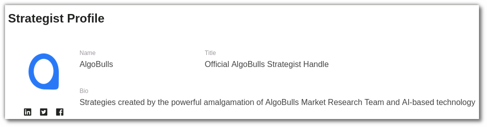
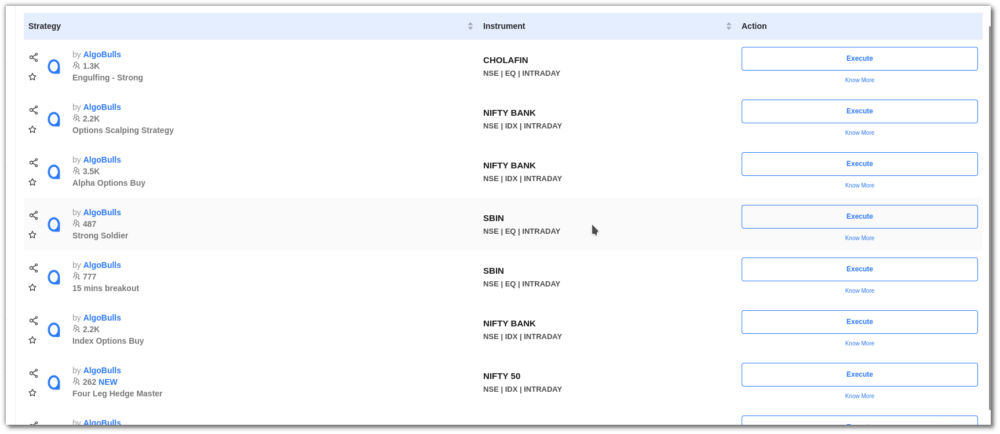
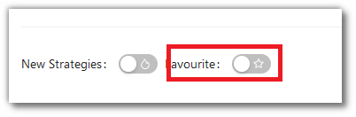
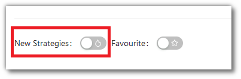
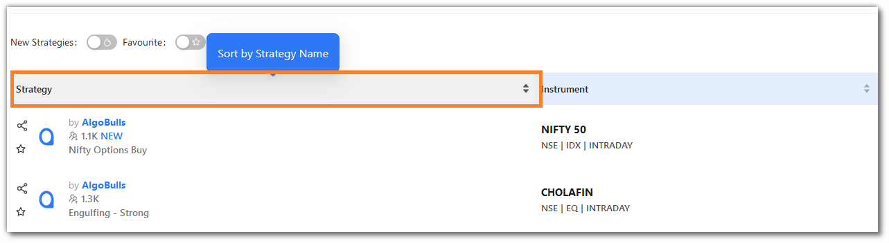
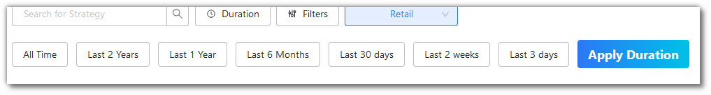
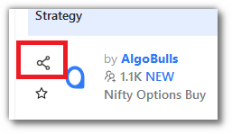
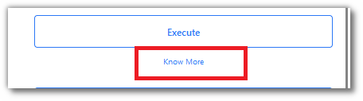

# Strategist Profile

## Introduction

AlgoBulls provides a variety of trading strategies, but the brains behind these strategies are strategists who work extremely hard to create powerful yet simple strategies. The Strategist profile will help you recognise the strategist's work and
strategies. Let’s take a look at what the strategist profile offers.

## Strategist Details

View the strategist's details such as Name, Bio and Contact Information.

[//]: # (## Strategist Profile Summary)

[//]: # (Get the strategist’s profile summary details such as the total number of strategies, deployments, trades, wins, total loss, long trades, short trades, max gain, and more.)

[//]: # ([![Strategist Profile]&#40;imgs/strategist_profile_summary.png "Click to Enlarge or Ctrl+Click to open in a new Tab"&#41;]&#40;imgs/strategist_profile_summary.png&#41;)

[//]: # (## Explore the strategies)
[//]: # ()
[//]: # (Explore the strategies developed by the strategist as per the marketplace. Analyze the growth, trading volume, and total trades of the strategist's strategy using the Heatmap. Odyssey is divided into 3 parts - Retail, Premium and HNI.)
[//]: # ()
[//]: # ([![Strategist Profile]&#40;imgs/strategist_profile_heat_map.png "Click to Enlarge or Ctrl+Click to open in a new Tab"&#41;]&#40;imgs/strategist_profile_heat_map.png&#41;)

## Strategy 

View the strategies created by the strategist here. Retail, Premium, and HNI strategies developed by this strategist are displayed.

## 5. Explore Strategies
---
You can find strategies using the following options: 

### i. Search Bar

Use this to type in the **strategy name** or **strategy code** to search for strategies.

### ii. Filters

[//]: # (You can filter your view as per the **ROI %, risk %, capital required & hit ratio**. You can also use the filter option for **brokers, exchanges, segments, modes, candle types, candle sizes** and **tags**. Click on the **Apply Filters** button to see the results.)
You can filter your view as per the  **brokers, exchanges, segments, modes, candle types, candle sizes** and **tags**. Click on the **Apply Filters** button to see the results.

### iii. Favourites

Use the toggle button to activate the Favourite Mode to view the strategies marked as **Favourite** (**☆**).

### iv. New Strategies

Use the toggle button to activate the New strategies Mode to view the strategies which are newly added by the strategist.

### v. Sort

You can sort the strategies by clicking on the heading of each column:

[//]: # (* ROI)

* Strategy 

* Instruments

### v. Duration

This option allows you to search for strategies that have been added to the marketplace in the last 3 days, 14 days, 30 days and All Time. Click on **Apply Duration** to save the changes. 

### vi. Pagination

You can click the **<** and **>** for changing pages. You can also choose to view **4/8/12** strategies per page.

    

### vii. Share

This button helps you share your favourite strategy with friends and family. You can click the share icon in strategy column to share this strategy.

### viii. Know more

Click the 'Know More' button below the 'Execute' button to discover additional details about this strategy.

