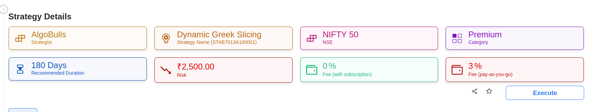
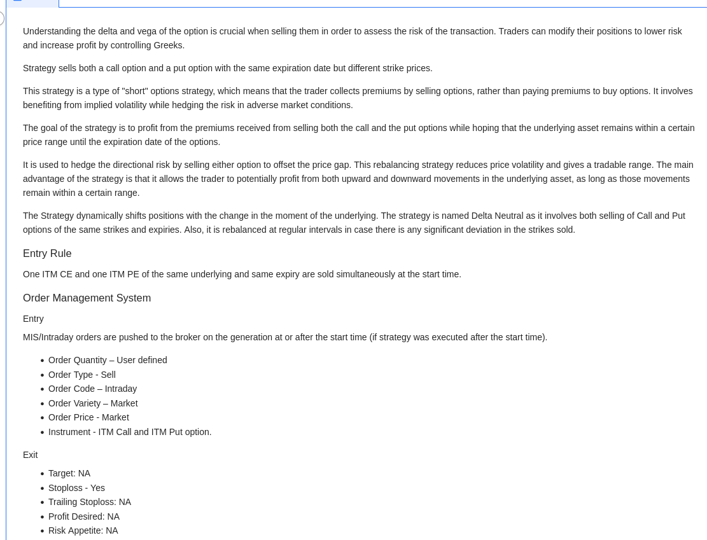
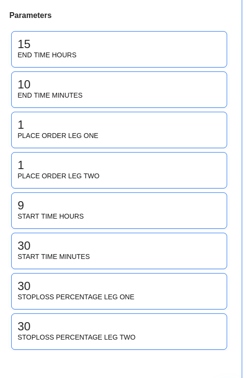

# Strategy Details

<iframe width="560" height="315" src="https://www.youtube.com/embed/y8InDcPQckU" frameborder="0" allow="accelerometer; autoplay; encrypted-media; gyroscope; picture-in-picture" allowfullscreen></iframe>

## 1. Introduction

This page provides detailed information about a strategy.

## 2. How to Find Details of a Strategy

To check the details of a strategy, go to the Odyssey page, select a strategy of your choice, and click on the "Know More" link in the **Action** column.

## 3. Strategy Details Page

The Strategy Details page contains the following information about the strategy:

- **Strategist Name**
- **Strategy Name**
- **Instruments and Exchange**
- **Strategy Category**
- **Recommended Duration**
- **Risk**
- **Fee (with subscription)**
- **Fee (Pay as you go)**

## 4. Strategy Details

This section contains all the information about the strategy.

## 5. Parameters

This section contains the parameters used in the strategy.

