# Strategy Card

## 1. Introduction

A strategy card has all the information you need about a strategy before you begin Algo trading. To know about the strategy, select a marketplace, search for the strategy you would like to use and click execute to add it to your [My Portfolio](https://help.algobulls.com/member/my-portfolio.html) page. 

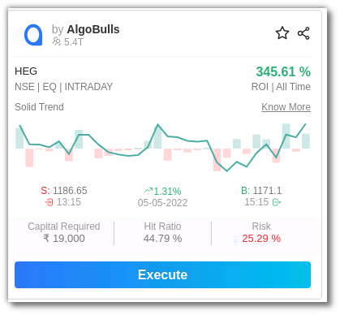

## 2. Summary Bar

You can check the `minimum capital required in demat, transaction fee with pack and without the package, recommended duration` and `strategy code`.  

## 3. Fields

You can also check the Strategy, Instrument, Capital Required, Hit Ratio, Risk, ROI and Growth here. You can use the Action column to execute a strategy. 

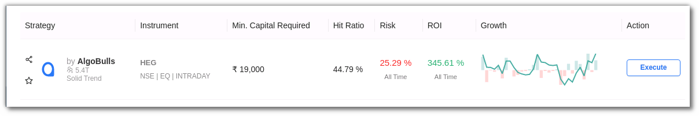

`By selecting the All time, 1 month, 14 days, or 3 days tab, you may view the strategies' past performance or back-tested data based on duration.`

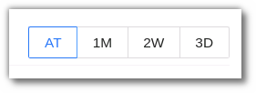

The strategy card is divided into 3 sections - `Records, Analytics & Returns`.

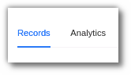

## 4. Records

### i. Trade Summary

The records section includes the Gross Profit/Loss, Trading Volume & Total Trades. 

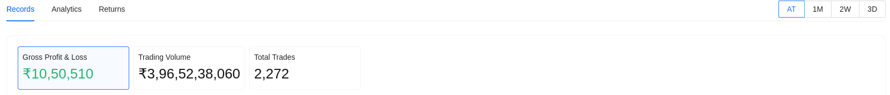

### ii. Heat Map

A heatmap of your tradebook is also displayed here. The heatmap is segregated in shades of green and red. Data can be viewed daily, weekly, monthly, and yearly. Dark green denotes highest profit and red denotes maximum loss.

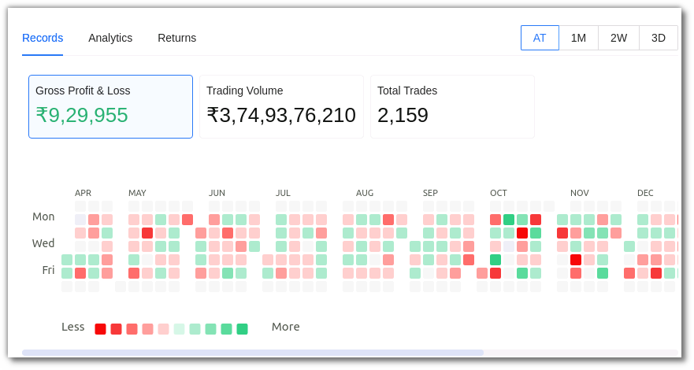

### iii. Backtesting Data
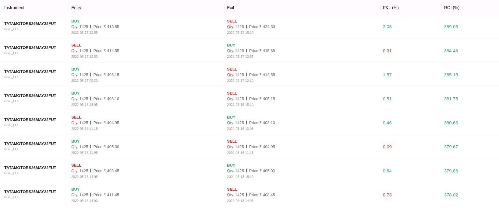

This is the trade report. You will be able to see the strategy's instrument, entry, and exit details. By using the toggle button, you can also analyse your P&L and ROI in % or INR.

## 5. Analytics

This section includes a detailed analysis of the strategy.

In the Analytics section you can check the past performance in a graphical representation. 

### i. Stats

In this section you can see the Hit Ratio, Number of Trades, Average Trades per day. 

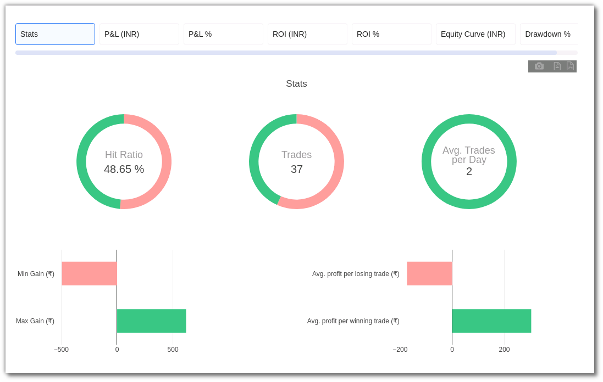

### ii. P&L

The cumulative backtesting P&L.

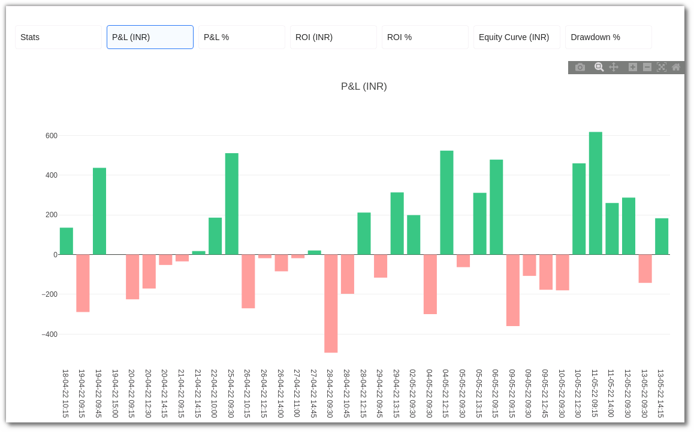

### iii. P&L%

The cumulative backtesting P&L percentage. 

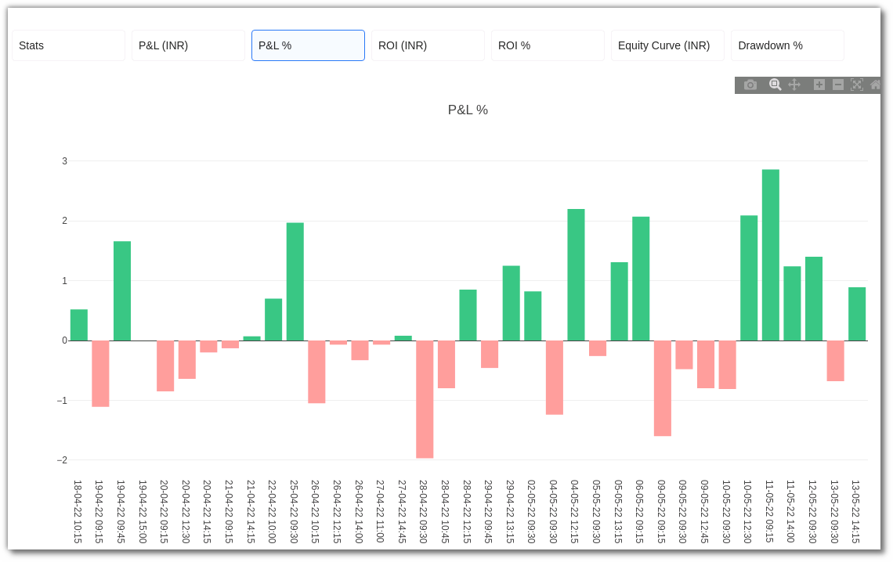

### iv. ROI (INR)

Cumulative P&L absolute value divided by Minimum Capital Required, ROI indicates a simulated yet accurate representation of return on capital employed.

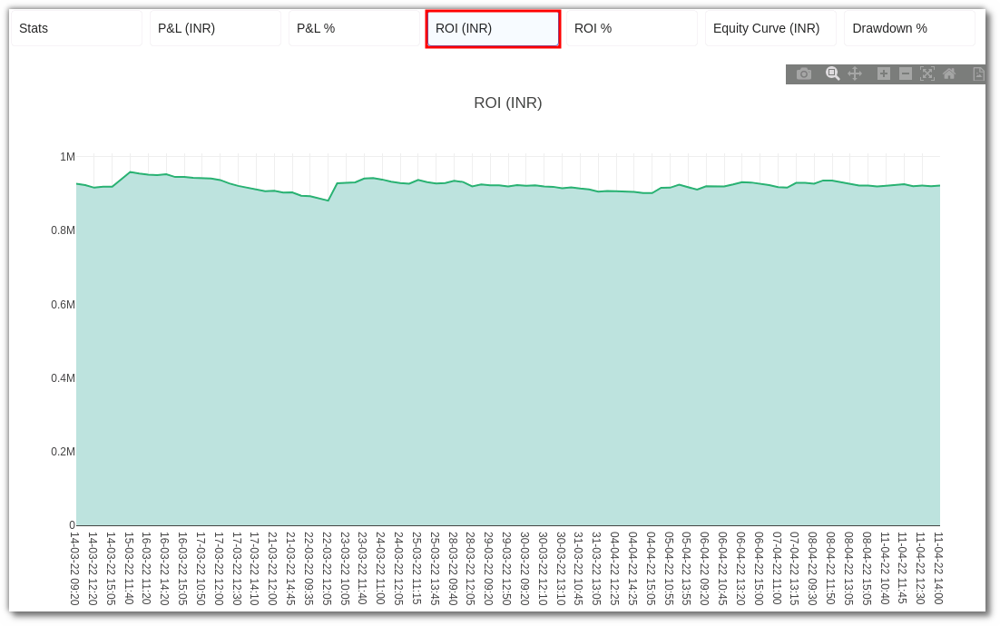

### v. ROI%

You will be able to view the ROI in percentage here 

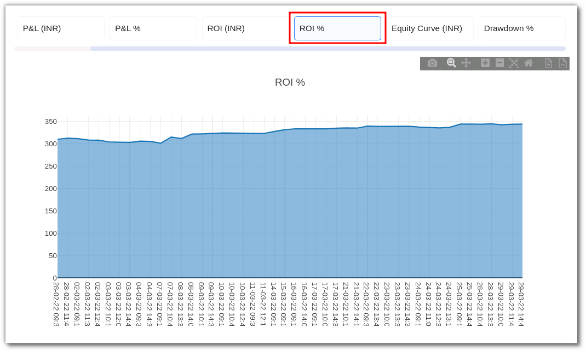

### vi. Equity Curve (INR)

Find the Equity Curve here, Formula used:   

      `Equity Curve = (Minimum Capital Required) + (P&L Cumulative)`

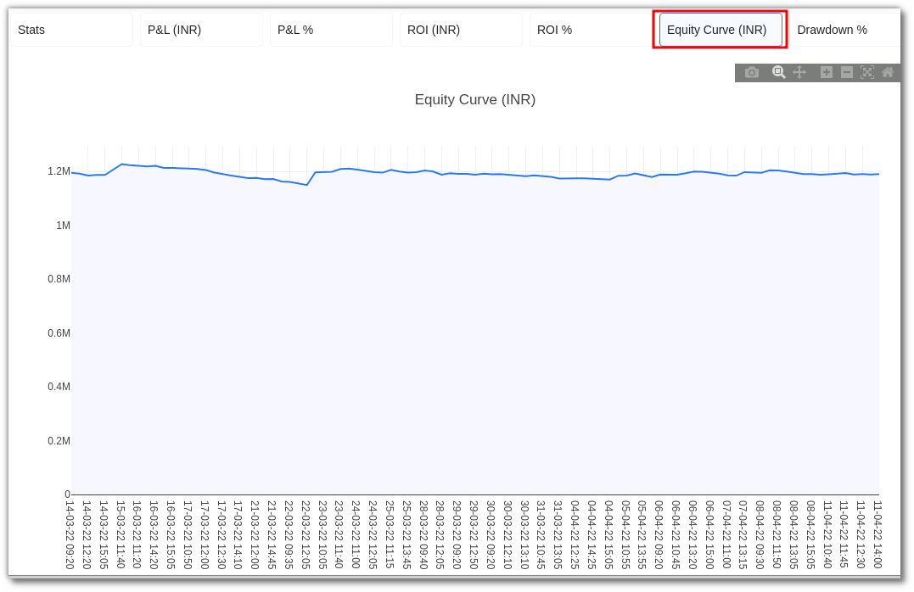

### vii. Drawdown %

The maximum loss your strategy has encountered during the execution in percentage.

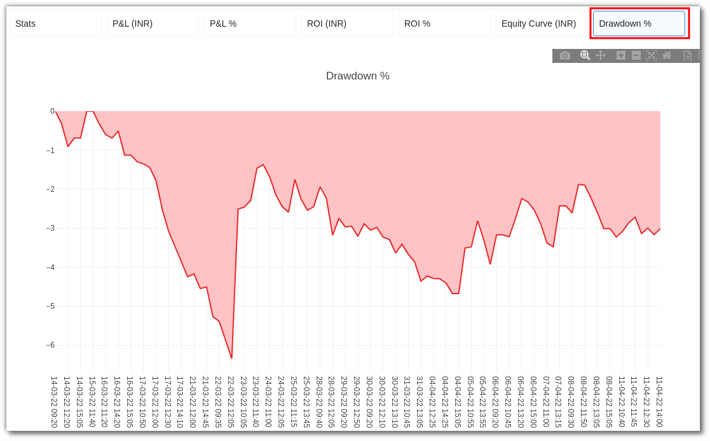

## 6. Graph Toolbar

`Snapshot Tool` - This tool helps you take a screenshot. Download the plot as PNG by using the snapshot tool from the Toolbar.

`Zoom Tool` - Zoom in to the plot by using the magnifying glass tool.

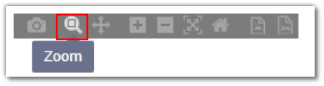

`Pan Tool` - The Pan tool enables you to move the view vertically or horizontally.

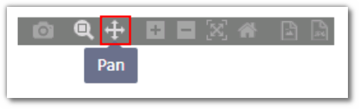

`Zoom in/Zoom Out` - Magnify or reduce the view of your image with the Zoom in/Zoom out tool.

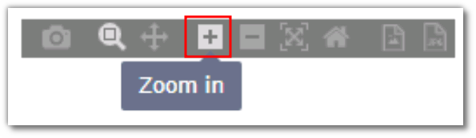

`Autoscale Tool` - Use this tool to automatically scale the image.

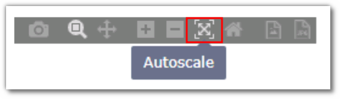

`Reset axes` - Reset the axes by using the ‘Reset axes’ tool.

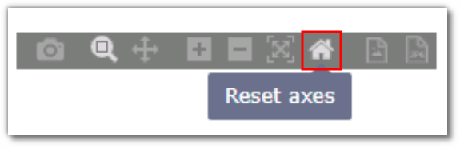

`Download as SVG/JPWG` - Download the plot as an SVG or JPEG using these tool. 

## 7. NET ROI Analysis
---

In the Net ROI Analysis, view the details in a graphical representation or % by using the toggle button on the top right corner. 

`The Net ROI is the total amount gained from a strategy after all brokerage and government charges are deducted.`
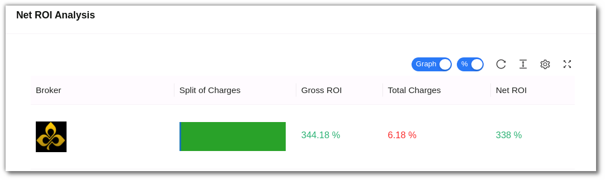

You can also switch the data from % to INR with the toggle button from the toolbar

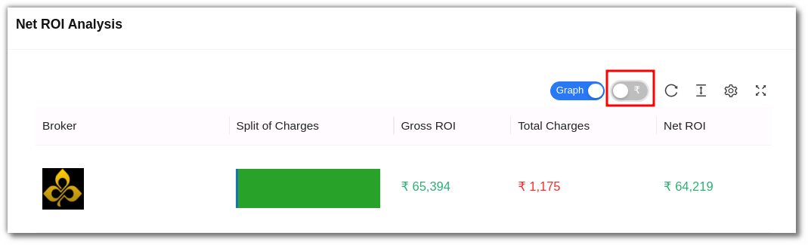

The broker, split charges for the strategy, Gross ROI, Total Charges and Net ROI are displayed in the `graph mode`

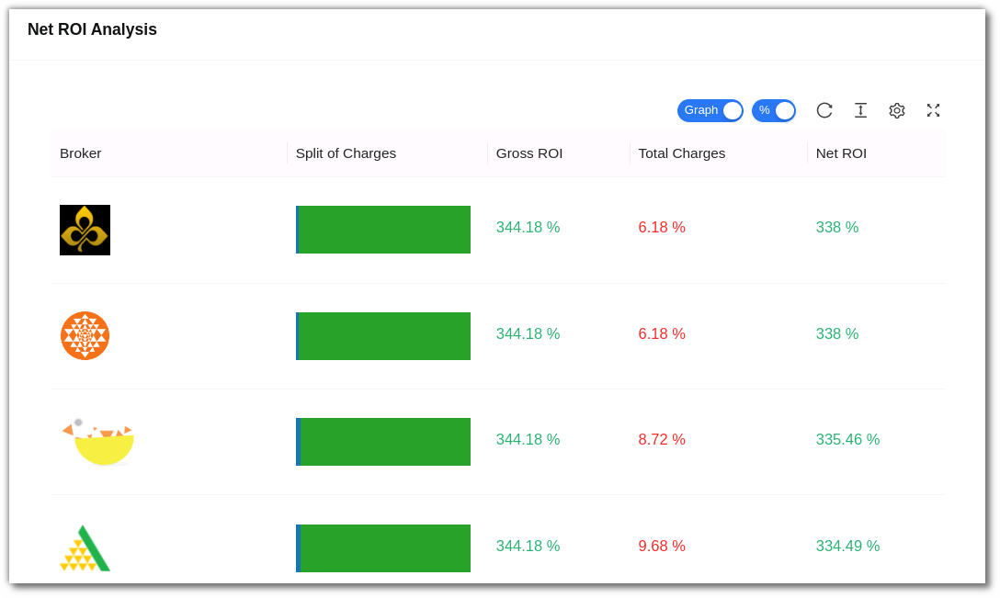

In the `Data mode`, you can view the Broker, Broker Charges, Govt.Charges, Gross ROI, Total Charges & Net ROI. 

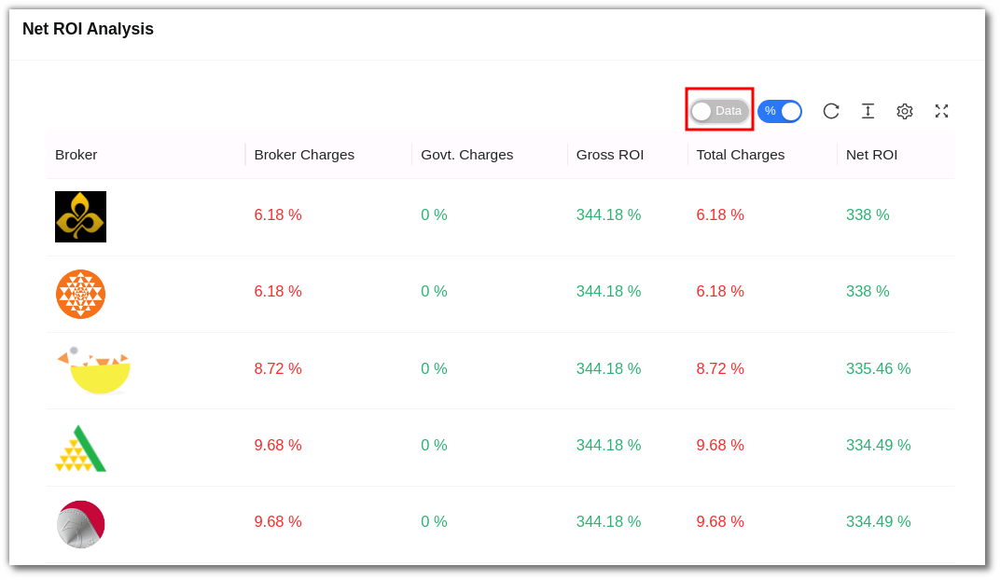

## 8. Strategy Details

Get a detailed overview of the strategy and its parameters. 

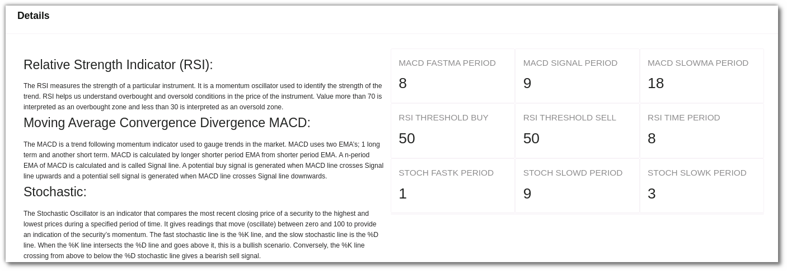

## 9. Returns

You can view a strategy’s ROI in the returns section. The returns duration and the ROI% is displayed here. 

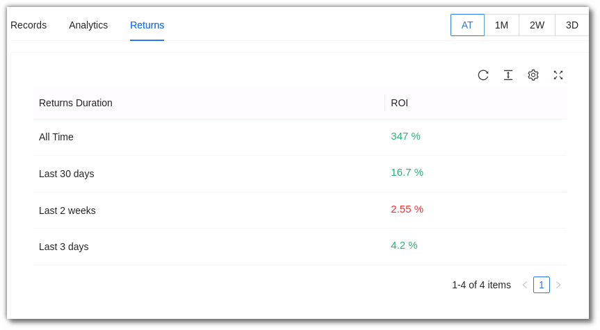

## 10. Toolbar

`Refresh` - If you can't see an entry in the table (perhaps the most recent one), click Refresh to check again.

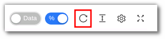

`Density` - View data comfortably by choosing the density. The options include Larger, Middle and Compact.

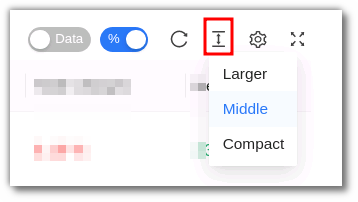

`Settings` - Select the columns that you want to view in this settings option.

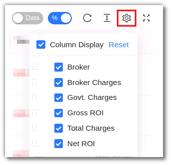

`Full Screen` - With this option you will be able to view your current tab on the browser in full Screen. To go back to the normal viewing mode click on it again. This is similar to pressing F11 on most browsers and operating systems.

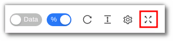

