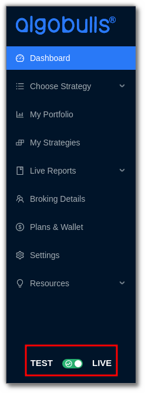
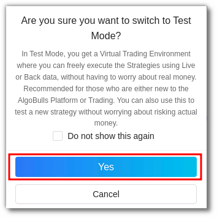
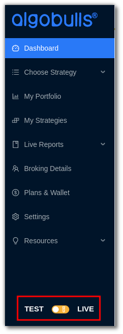
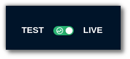

# Test & Live Mode

The Test Mode on AlgoBulls is a virtual simulation of the real markets. 

You can test a strategy in live markets without risking any money through Paper Trading, modify strategies using the Tweak option and test the past performance data for that strategy through Backtesting. 

Ensure the toggle button on the bottom left side of the website is switched to Test Mode. 

In the test mode, you can backtest or paper trade in 4 simple steps. Learn how to backtest or paper trade in test mode [here](virtual-trading.md) .

The ‘Live Mode’ is where you can execute strategies to begin real trading. Switch the toggle button on the bottom left side of the website to LIVE MODE. 

The choose strategy marketplace includes more than 100+ strategies that you can choose from; select a strategy, click execute and begin live trading. 

To avoid additional charges for services used in Real Trading, ensure you subscribe to a plan from the [Plans & Wallet](https://app.algobulls.com/wallet?defaultCategory=backtesting%26PaperTrading) section.
