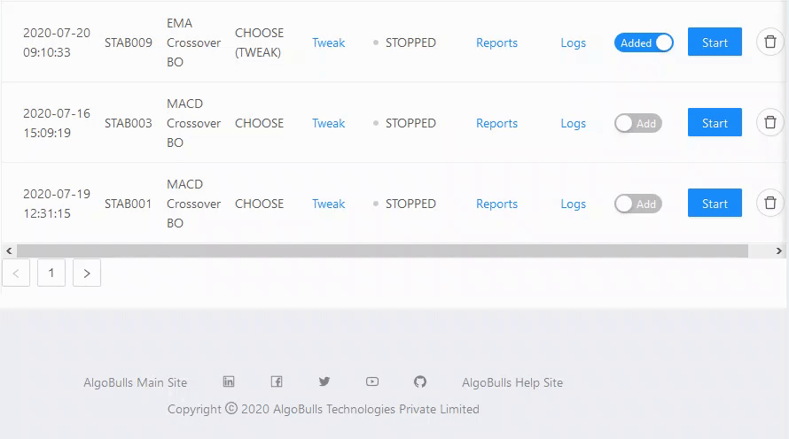
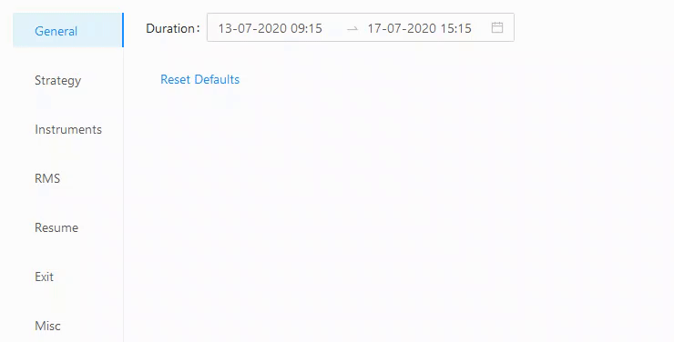
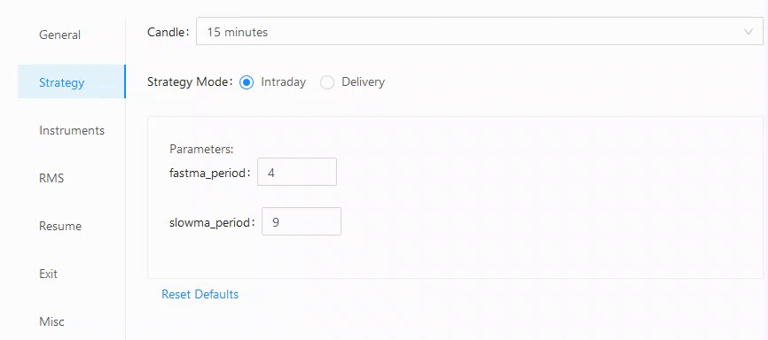
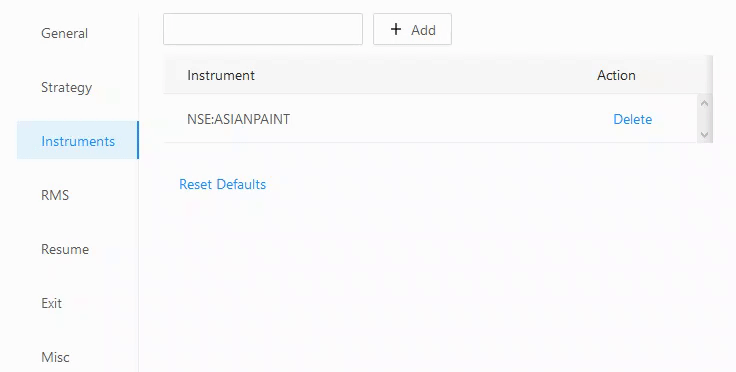
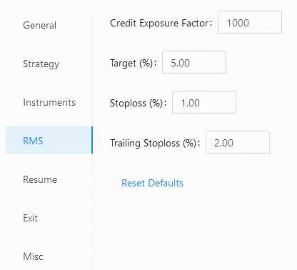
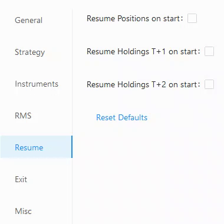
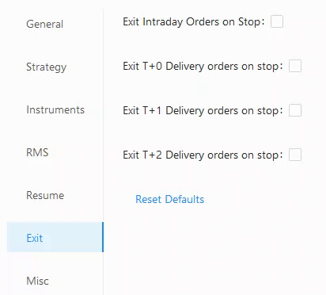
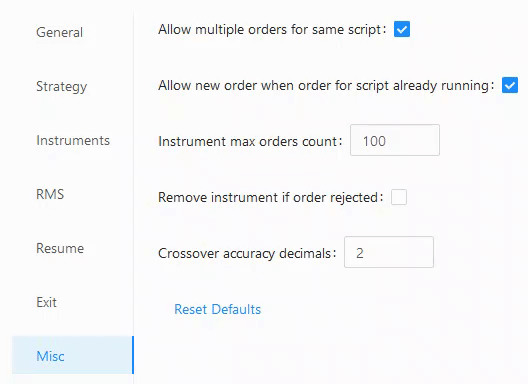

# Tweak

## General
---
	`Duration` - 

## Strategy
---
	`Candle` - 
	`Strategy Mode` - Intraday / Delivery
	`Parameters` - (Strategy Specific)
		fastma_period
		slowma_period

## Instruments
---
	`Add` - 

## RMS
---
	`Credit Exposure Factor` - 
	`Target (%)` - 
	`Stoploss (%)` - 
	`Trailing Stoploss (%)` - 

## Resume
---
	`Resume Positions on start` - 
	`Resume Holdings T+1 on start` - 
	`Resume Holdings T+2 on start` - 

## Exit
---
	`Exit Intraday Orders on stop` - 
	`Exit T+0 Delivery orders on stop` - 
	`Exit T+1 Delivery orders on stop` - 
	`Exit T+2 Delivery orders on stop` - 

## Misc
---
	`Allow multiple orders for same script` - 
	`Allow new order when order for script already running` - 
	`Instrument max orders count` - 
	`Remove instrument if order rejected` - 
	`Crossover accuracy decimals` - 
