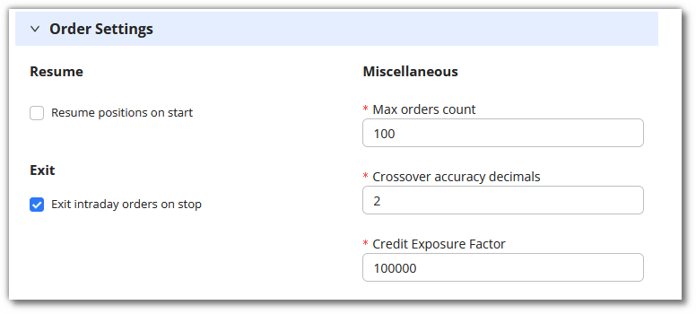

# Tweak

## 1. Introduction

If you'd like to tweak the strategies for **backtesting or paper trading**, AlgoBulls also has a **Tweak** option.
Before entering the live markets, you can tweak different parameters of a strategy to see how they function and what results are generated

## 2. How to tweak a strategy?

**Step 1:** Go to my portfolio page.

**Step 2:** To tweak a strategy, click the tweak button on the strategy from config column.

**Step 3:** Tweak mode will open in view mode, but you can edit it by clicking on edit button from right side.

**Change Instruments** You can change the instruments as per your choice.

**Order Settings** Change Order Settings

**Strategy Settings** Change Strategy Settings here. In strategy settings, you can select the **candle duration, strategy mode**.

**Strategy Parameters** Change Strategy Parameters

**Step 4:** Once you are convinced and happy with the tweak, click **save** to save the strategy with tweaked configs. Or you can click on **Save as New** to save a new strategy with changed parameters.

You can also add tags to the tweaked strategy as per your requirement.

## 3. How to apply the tweaked strategy in live trading?

To know more about applying your tweaked strategy in the live markets, [click here](https://help.algobulls.com/member/virtual-trading.html#3-how-to-tweak-a-strategy-on-algobulls). 