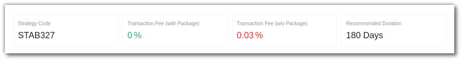
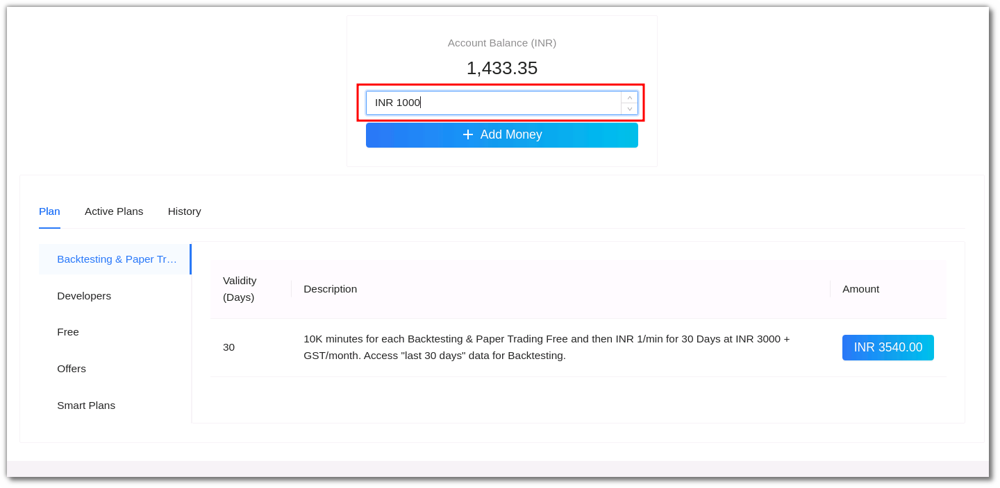
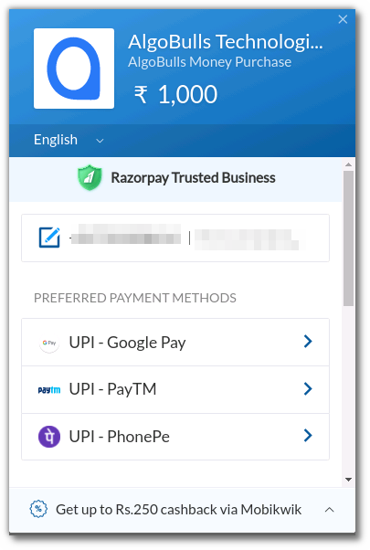
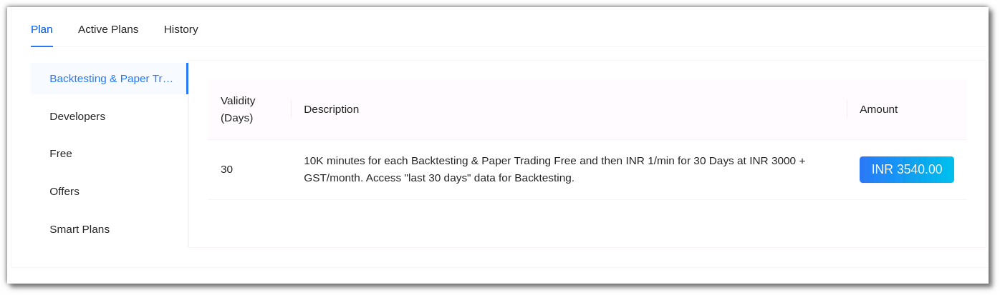

# Plans and Wallet

Add money to your AlgoBulls account or subscribe to a plan from here 

* Choose from Pay-per-use model or subscription model.
* Add money to your AlgoBulls wallet.
* Avoid transaction fees or additional charges by subscribing to our plans. 

## Models

The AlgoBulls platform works on 2 models: Pay-per-use model & Subscription model 

* `Pay-per-use Model`: You deposit funds into your AlgoBulls Wallet in this model. You are charged for various services that you use.This may include backtesting, paper trading, tweaking strategies and more. To keep track of the usage costs, always check your Fund Book in the Live reports section.

### Plans for the Pay-per-use Model

| Action                                                   | Cost |
|----------------------------------------------------------|------|
| Run backtesting for a tweaked strategy                   | 💰 Rs. 1/min   |
| Run paper trading for a strategy                         | 💰 Rs. 1/min    |
| Run real trading for a strategy                          | 💰    |

To know the charges for Real Trading, you have to check the ‘Transaction fee (w/o package) section in the strategy details as shown below: 

* `Subscription Model`: 
In this model you choose a package of your choice from the plans & wallets sections for a specific time duration. Hence all services included in the package will not incur any additional charges for that period. 

Here’s an example to help you understand better: 
If you activate a plan for Backtesting services for 3000 INR for 30 days (max 10K minutes), you will be able to use the service without incurring any further expenses for the next 30 days.
However for Real Trading, the subscription selected by you does not include this service. This means Real Trading service will continue to be charged according to the Pay-per-use Model. 

### Plans for the Subscription Model

| Action                                                   | Cost |
|----------------------------------------------------------|------|
| Add a strategy from Marketplace to your Portfolio        | 🆓  |
| View backtesting reports for a strategy from Marketplace | 🆓   |
| Tweak (change parameters of) a strategy                  | 🆓   |

Ensure you keep a track of the usage costs by checking the Fund Book. You can add money or subscribe to a plan from the Plans and Wallet section

## ADDING MONEY TO YOUR ALGOBULLS ACCOUNT

To add money to your AlgoBulls account. Choose ‘Plans & Wallet’ from sidebar navigation. Enter the amount and click on + Add Money. 

Enter your phone number & email address and click on proceed. 

Choose your preferred payment method. Once the payment is successful the balance will be added in your AlgoBulls account. 

All of your actions, such as backtesting, paper trading, and live trading, are charged depending on the amount in your wallet (wherever charges are applicable).

Your funds are reduced as you are charged, and when they reach zero, your account stops trading.

You can consider opting for packages/plans to get more cost-effective benefits.

# SUBSCRIBING TO A PLAN ON ALGOBULLS: 

## PLANS, ACTIVE PLANS & HISTORY

* `Plans` - A list of platform's available packages organised by category. The current category of plans include Backtesting & Papertrading, Developers, Free, Offers & Smart Plans.

* `Active Plans` - Plans that are active in your account currently. This includes the category, validity, description, amount, purchase date and end date. 

* `History` - A list of all the amounts you've added to your wallet in the past. This includes the Transaction ID, Plan created & updated, status and amount. 

To subscribe to a plan, click on the amount button for that plan. 

