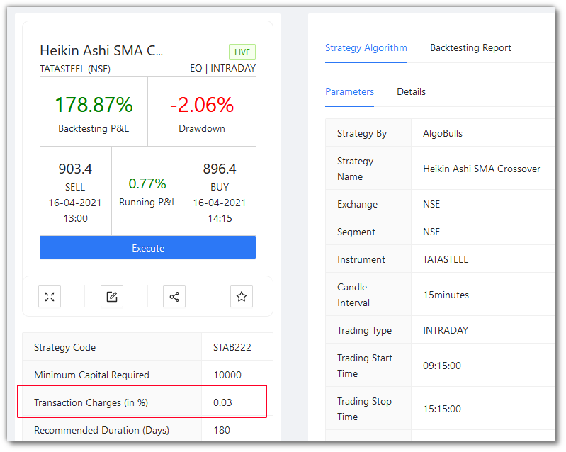

# Plans and Wallet

<iframe width="560" height="315" src="https://www.youtube.com/embed/KWfAVlhbDbU" frameborder="0" allow="accelerometer; autoplay; encrypted-media; gyroscope; picture-in-picture" allowfullscreen></iframe>

You can add funds to your wallet by clicking the `+ Add Money` button.

All your actions like tweaking, backtesting, paper trading and real trading are charged according to the funds in your wallet (wherever charges are applicable).

Your funds keep decreasing as and when you are charged, and once the funds become zero, your account stops trading.

If your actions are going to be quite extensive, then consider opting for packages/plans to get more economical benefits.

There are 3 tabs here:

`Plan` - A category-wise list of packages offering by the platform.

`Active Plans` - The currently active plan(s) in your account.

`History` - A list of all amounts that you have added to your wallet over a period of time.

## Models

There are 2 models:

* Subscription Model

* Pay-per-use Model

For both the models, the following actions are common and free:

| Action                                                   | Cost |
|----------------------------------------------------------|------|
| Add a strategy from Marketplace to your Portfolio        | 🆓  |
| View backtesting reports for a strategy from Marketplace | 🆓   |
| Tweak (change parameters of) a strategy                  | 🆓   |

### Plans for the Pay-per-use Model

| Action                                                   | Cost |
|----------------------------------------------------------|------|
| Run backtesting for a tweaked strategy                   | 💰 Rs. 1/min   |
| Run paper trading for a strategy                         | 💰 Rs. 1/min    |
| Run real trading for a strategy                          | 💰    |

!!! Note
    * To know the charges for Real Trading, you have to check out the specific strategy details as shown below:

### Plans for the Subscription Model

The following is a list of plans currently offered by our platform.

!!! Note
    * The plans shown above are subject to change. For the current plans, [visit here](https://app.algobulls.com/wallet).

## Payment, Active Plans and History

Click on the amount button of any plan to initiate payment for that plan. 

Click on `Active Plans` tab shown above to see the plan(s) currently active in your account.

Click on `History` tab shown above to see all previously used plans.
