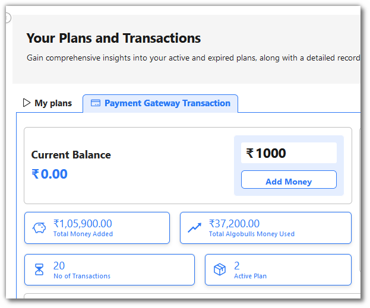

# Pricing

## 1. Introduction:

To begin trading with AlgoBulls, you must have a sufficient balance in your account.
This sum can be deposited into your wallet via the **My Plans** page.
Certain services that you use on AlgoBulls have charges involved, but to ensure that you can
start trading without worrying about the charges, we have a range of plans that you can subscribe to.

## 2. How to add money?

Go to **My Plans** page then go to Payment Gateway Transaction, add amount in Amount field click on **Add Money** button.

Learn more about [Pricing](https://help.algobulls.com/member/my_plans.html).

All of your actions, such as backtesting, paper trading, and live trading, are charged depending on the amount in your wallet (wherever charges are applicable).

Your funds are reduced as you are charged, and when they reach zero, your account stops trading.

You can consider opting for [subscription plans](https://app.algobulls.com/wallet?defaultCategory=smartPlans) to get more cost-effective benefits.

Here’s a quick explainer on how you can subscribe to a package of your choice.

## 3. Subscription plans:

### i. Odyssey Plans

By subscribing to odyssey plans, you can do trading using our pre-build strategies. These plans provide the following benefits.

* **Transactional Charges**

* **Max Tweak Limit**

* **Execution Time for Backtesting(in minutes)**

* **Execution Time for Paper Trading (in minutes)**

* **Historical Data Duration for Backtesting**

* **Execution Time for Phoenix (Backtesting/Paper Trading) in minutes**

* **Historical Data Duration for Backtesting (Phoenix)**

* **Strategies Allowed to Be Saved**

* **Total Strategies Allowed to Run in Parallel**

* **Live Trading Strategies Allowed to Run in Parallel**

* **Analytics Access**

* **Professional Support**

### ii. Phoenix Plans

* Other Benefits with Phoenix plans

* Strategy Development

* Strategy Execution

* Market Access

* Broker Dealer Support

* Security and Protection

* Analytics and Reporting

* Infrastructure

* Support and Customisation

### iii. Support Plans

If a user needs support related to strategy creation, support on video call, support on WhatsApp etc. User can purchase these plans.

## 4. Compare Plans:

### 1: Highlight Difference

### 2: Hide Common Features

## 5. How to subscribe to a plan?

To subscribe to a plan, you can choose a package of your choice from the Pricing page.

These plans are active for a specific time duration. Hence, all services included in the package will not incur any additional charges for that period.

* Select a plan of your choice and click on **Choose This Plan** button.

* You will be redirected to check out page where you can make payment and purchase the plan. 
